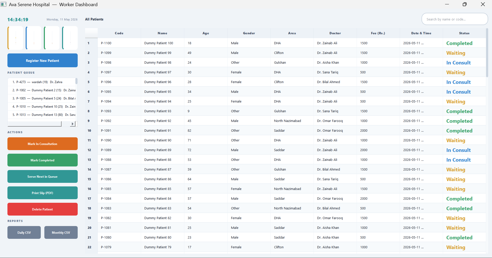
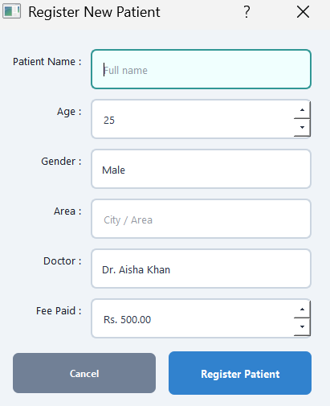

# AvaSerene-HMS

A B2B desktop application for hospital management. This system separates administrative controls from worker operations, featuring secure role-based access, real-time analytics, and automated PDF slip generation.

## Features

* **Role-Based Access Control:** Secure `bcrypt` password hashing for Admin and Worker dashboards.
* **Admin Dashboard:** Monitor hospital analytics, manage staff credentials, and track patient volumes.
* **Worker Dashboard:** Register patients, manage live queues, and update consultation statuses.
* **Automated PDF Receipts:** Generates pixel-perfect 80mm thermal slips using `reportlab`.
* **Data Export & Reporting:** Built-in reporting engine allowing workers to securely generate and export daily or monthly structural patient summaries into standard CSV formats.
* **Robust Database Integrity:** Engineered with PostgreSQL triggers to ensure data validation (e.g., age limits, fee constraints) and automated audit logging for all CRUD operations.

## Tech Stack

* **Language:** Python 3
* **GUI Framework:** PyQt5
* **Database:** PostgreSQL (via `psycopg2`)
* **Security:** `bcrypt`
* **Document Generation:** `reportlab`

##  Screenshots

**Admin Dashboard**<br>


**Worker Dashboard**<br>


**Patient Registration**<br>


## Installation & Setup

1. **Clone the repository:**
   ```bash
   git clone [https://github.com/Farzeen-Fatima/AvaSerene-HMS.git](https://github.com/Farzeen-Fatima/AvaSerene-HMS.git)
   cd AvaSerene-HMS
2. **Install dependencies:**
   ```bash
pip install -r requirements.txt

3.**Database Setup:**
*Create a PostgreSQL database (e.g., ava_serene_hospital).
*Run the provided SQL script to build the schema:

```bash
psql -U postgres -d ava_serene_hospital -f ava_serene_hospital.sql

4.**Run the Application:**

```bash
python login_window.py
